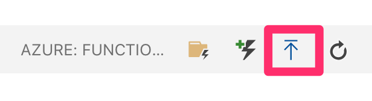

# DotNet Azure Function Web API secured by Azure AD

This code example demonstrates how to secure an Azure Function with Azure AD when the function uses HTTPTrigger and exposes a Web API. The Web API is written using dotnet and c#, and the authentication is provided by msal.

This readme walks you through the steps of setting this code up in your Azure subscription.

While you can develop Azure Functions in many ways, such as Visual Studio 2019, Visual Studio Code, etc. this guide shows how to perform the steps using Visual Studio Code.

## Contents

Outline the file contents of the repository. It helps users navigate the codebase, build configuration and any related assets.

| File/folder       | Description                                |
|-------------------|--------------------------------------------|
| `src`             | Sample source code.                        |
| `.gitignore`      | Define what to ignore at commit time.      |
| `CHANGELOG.md`    | List of changes to the sample.             |
| `CONTRIBUTING.md` | Guidelines for contributing to the sample. |
| `README.md`       | This README file.                          |
| `LICENSE`         | The license for the sample.                |
| `images`          | Images used in readme.md.                  |
| `Function`        | The Azure Function code.                   |

## Prerequisites

1. You must have Visual Studio Code installed
2. You must have Azure Functions core tools installed `npm install -g azure-functions-core-tools`
3. Azure Functions VSCode extension (https://marketplace.visualstudio.com/items?itemName=ms-azuretools.vscode-azurefunctions)
4. You must have dotnetcore installed on your local dev environment

## Register an AAD App

Reference: [How to register an app](https://docs.microsoft.com/en-nz/azure/active-directory/develop/quickstart-register-app)

The Azure Function acts as a WebAPI. There are a few things to know here.
1. The function app will run on `http://localhost:7071` when you test it locally.
2. The function app will run on `https://<yourdotnetfunction>.azurewebsites.net` when you run it deployed in azure
3. The function exposes an API with app id uri `https://<yourdotnetfunction>.<tenant>.onmicrosoft.com`

Note that all these values are configurable to your liking, and they are reflected in the `MyHttpTrigger\index.js` file.

Additionally, you will need a "client" for the Web API. Since this function will serve as a AAD protected Web API, any client that understands standard openid connect flows will work. The usual consent grant principals apply. 

Reference: [Azure Active Directory consent framework](https://docs.microsoft.com/en-us/azure/active-directory/develop/consent-framework)

To keep things simple, we will reuse the same app registration as both the client, and the API. This eliminates any need to provide explicit consent. For our code example here, the client will use [auth code flow](https://docs.microsoft.com/en-us/azure/active-directory/develop/v2-oauth2-auth-code-flow), for which we will also need a client secret. We are trying to mimic a web app calling this API, and a web app can act as a confidential client.

To setup the app, you can use the below azure CLI script. Note the placeholders demarcated in `<..>` brackets. Make sure to replace them with your environment specific values.

``` SHELL
az ad app create --display-name "FuncAPI" --credential-description "funcapi" --password "p@ssword1" --reply-urls "http://localhost:7071" --identifier-uris "https://funcapi.<tenantname>.onmicrosoft.com"
```

For the above registered app, get the app ID
``` SHELL
az ad app list --query "[?displayName == 'FuncAPI'].appId"
```

Also get your tenant ID
``` SHELL
az account show --query "tenantId"
```

Update your `Constants.cs` with the values per your app registration. Specifically, update the below lines.

``` CSharp
internal static string audience = "https://funcapi.<tenantname>.onmicrosoft.com/user_impersonation"; // Get this value from the expose an api, audience uri section example https://appname.tenantname.onmicrosoft.com
internal static string clientID = "<appid>"; // this is the client id, also known as AppID. This is not the ObjectID
internal static string tenant = "<tenantname>.onmicrosoft.com"; // this is your tenant name
internal static string tenantid = "<tenantid>"; // this is your tenant id (GUID)
```

 ## Test your function - locally

 1. With the project open in VSCode, just hit F5, or you can also run `func host start` from the CLI.
 2. You will need an access token to call this function. In order to get the access token, open browser in private mode and visit
 ```
 https://login.microsoftonline.com/<tenantname>.onmicrosoft.com/oauth2/v2.0/authorize?response_type=code&client_id=<appid>&redirect_uri=http://localhost:7071/&scope=openid
```

This will prompt you to perform authentication and consent, and it will return a code in the query string. 
Use that code in the following request to get an access token, remember to put in the code and client secret.
I am using the client secret of `p@ssword1` as I setup in my scripts above. In production environments, you want this to be more complex.

``` SHELL
curl -X POST \
  https://login.microsoftonline.com/<tenantname>.onmicrosoft.com/oauth2/v2.0/token \
  -H 'Accept: */*' \
  -H 'Cache-Control: no-cache' \
  -H 'Connection: keep-alive' \
  -H 'Content-Type: application/x-www-form-urlencoded' \
  -H 'Host: login.microsoftonline.com' \
  -H 'accept-encoding: gzip, deflate' \
  -H 'cache-control: no-cache' \
  -d 'redirect_uri=http%3A%2F%2Flocalhost:7071&client_id=<appid>&grant_type=authorization_code&code=<put code here>&client_secret=p@ssword1&scope=https%3A%2F%funcapi.<tenantname>.onmicrosoft.com%2F/user_impersonation'
  ```
 
 3. Once you get the access token, make a GET request to `http://localhost:7071/Authenticated` with the access token as a Authorization Bearer header. Verify that you get an output similar to the below. The values marked as ..removed.. will have actual values in your output.

 ``` JSON
{
    "aud": "https://funcapi.<tenantname>.onmicrosoft.com",
    "iss": "https://sts.windows.net/<tenantid>/",
    "iat": 1571732525,
    "nbf": 1571732525,
    "exp": 1571736425,
    "acr": "1",
    "aio": "..removed..",
    "amr": [
        "pwd"
    ],
    "appid": "..removed..",
    "appidacr": "1",
    "email": "..removed..",
    "family_name": "..removed..",
    "given_name": "..removed..",
    "idp": "..removed..",
    "ipaddr": "..removed..",
    "name": "..removed..",
    "oid": "..removed..",
    "scp": "user_impersonation",
    "sub": "..removed..",
    "tid": "..removed..",
    "unique_name": "..removed..",
    "uti": "..removed..",
    "ver": "1.0"
}
```

 ## Test your function - in Azure

 1. Go ahead and create a function app in azure, ensure that you pick dotnet
 2. Choose to deploy the function

 
 
 3. You will need an access token to call this function. In order to get the access token, open browser in private mode and visit
```
https://login.microsoftonline.com/<tenantname>.onmicrosoft.com/oauth2/v2.0/authorize?response_type=code&client_id=<appid>&redirect_uri=https://<yourdotnetfunction>.azurewebsites.net/callback&scope=openid
```

This will prompt you to perform authentication, and it will return a code. 
Use that code in the following request to get an access token, remember to put in the code and client secret.

``` SHELL
curl -X POST \
  https://login.microsoftonline.com/<tenantname>.onmicrosoft.com/oauth2/v2.0/token \
  -H 'Accept: */*' \
  -H 'Cache-Control: no-cache' \
  -H 'Connection: keep-alive' \
  -H 'Content-Type: application/x-www-form-urlencoded' \
  -H 'Host: login.microsoftonline.com' \
  -H 'accept-encoding: gzip, deflate' \
  -H 'cache-control: no-cache' \
  -d 'redirect_uri=https%3A%2F%2F<yourdotnetfunction>.azurewebsites.net%2Fcallback&client_id=<appid>&grant_type=authorization_code&code=<put code here>&client_secret=<put client secret here>&scope=https%3A%2F%2Fmytestapp.<tenantname>.onmicrosoft.com%2Fuser_impersonation'
  ```
 
 3. Once you get the access token, make a GET request to `https://<yourdotnetfunction>.azurewebsites.net/Authenticated` with the access token as a Authorization Bearer header. Verify that you get an output similar to the below. The values marked as ..removed.. will have actual values in your output.

``` JSON
{
    "aud": "https://funcapi.<tenantname>.onmicrosoft.com",
    "iss": "https://sts.windows.net/<tenantid>/",
    "iat": 1571732525,
    "nbf": 1571732525,
    "exp": 1571736425,
    "acr": "1",
    "aio": "..removed..",
    "amr": [
        "pwd"
    ],
    "appid": "..removed..",
    "appidacr": "1",
    "email": "..removed..",
    "family_name": "..removed..",
    "given_name": "..removed..",
    "idp": "..removed..",
    "ipaddr": "..removed..",
    "name": "..removed..",
    "oid": "..removed..",
    "scp": "user_impersonation",
    "sub": "..removed..",
    "tid": "..removed..",
    "unique_name": "..removed..",
    "uti": "..removed..",
    "ver": "1.0"
}
```
## Contributing

This project welcomes contributions and suggestions.  Most contributions require you to agree to a
Contributor License Agreement (CLA) declaring that you have the right to, and actually do, grant us
the rights to use your contribution. For details, visit https://cla.opensource.microsoft.com.

When you submit a pull request, a CLA bot will automatically determine whether you need to provide
a CLA and decorate the PR appropriately (e.g., status check, comment). Simply follow the instructions
provided by the bot. You will only need to do this once across all repos using our CLA.

This project has adopted the [Microsoft Open Source Code of Conduct](https://opensource.microsoft.com/codeofconduct/).
For more information see the [Code of Conduct FAQ](https://opensource.microsoft.com/codeofconduct/faq/) or
contact [opencode@microsoft.com](mailto:opencode@microsoft.com) with any additional questions or comments.
